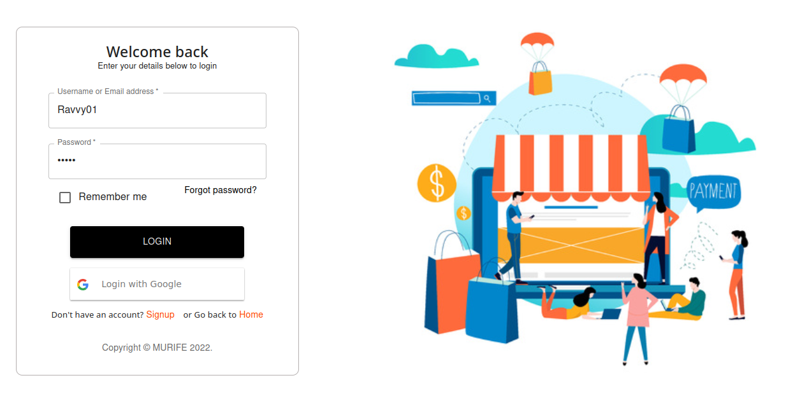
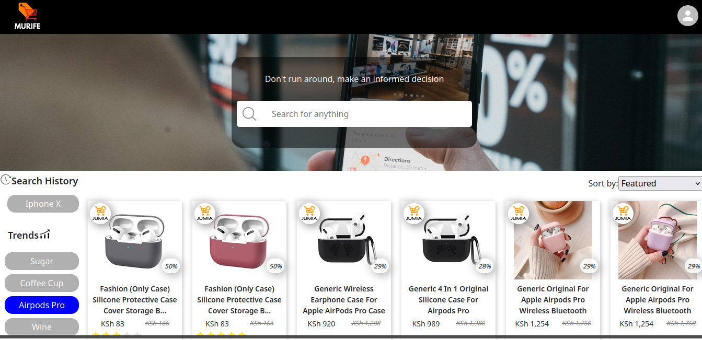
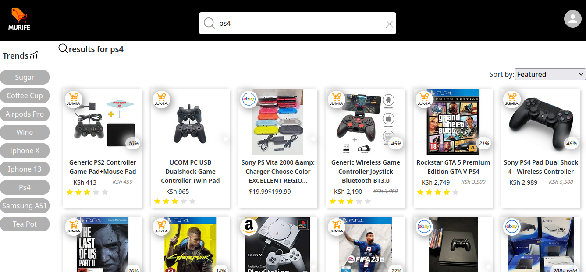

# <h1 align="center">Murife Shopping Community App</h1>

``Murife shopping`` website is used to help customers make the right choice when it comes to purchasing products online. The site gives the user an avenue to search for a product, compare the product's cost and marginal benefits based on prices, ratings, mode of payment etc, and decide which product they want and from which online shop.

<h2>This project was Contributed to by;</h2>

* [Kelvin Mwaura](https://github.com/Aimkeys-Sir)
* [Brian Wangila](https://github.com/BrianWangila)
* [Peter Karanja](https://github.com/JAJAKIM22)
* [Faith Murithi](https://github.com/gatwi)
* [Kelvin Mwendwa](https://github.com/Kelvinmwendwa)
* [Okubasu Franklin](https://github.com/Okubasufrank)

<h2>🚀 Demo</h2>

* [Click to view demo video](https:)

<h1>Project Screenshots:</h1>

<h1>Features (MVP) 🧐</h1>

* A user can search for a product from various online shops and rank by price or other aspects
* A user can be authenticated and have his searches saved in the database for future reference
* The site displays trending products from select shops
* All users can interact with the site without having to be authenticated.
* A list of trending searches is displayed on the side

<h1>Requirements:</h1> 
In order for you to use the content on this repo, ensure you have the following:

 * Access to a computer or laptop that runs on either of the following:
 - Stable version of NPM installed in you machine
 - windows 7+, Linux, Mac OS
 - nodejs 9.0+
 * Access to the internet  
 * Some bit of patient for your own sanity

<h1>Installation Steps 🛠️ :</h1>

 *****
### Alternative One

- Open a terminal / command line interface on your computer
- Clone the repo by using the following:

        git clone git@github.com:Aimkeys-Sir/online-comm-frontend.git

- Be patient as it creates a copy on your local machine for you.
- Change directory to the repo folder:

        cd online-comm-frontend

- (Optional) Open it in ``Visual Studio Code``

        code .

- (Alternate Option) Open it in any editor of your choice.
- Hurray! You are one step closer to being as intelligent as Einstein.
 *****

### Alternative Two

- On the top right corner of this page there is a button labelled ``Fork``.
- Click on that button to fork the repo to your own account.
- Take on the process in ``Alternative One`` above.
- Remember to replace your username when cloning.

        git clone https://github.com/your-username-here/online-comm-frontent.git

## Running the application

Running the application is very straight forward. You can use the following steps to run the app.

- Install required dependencies from npm

      npm install

- Run the application on the browser

      npm start

<h1>🍰 Contribution Guidelines:</h1>

Please contribute using forking GitHub Flow. 
Create a branch add commits and open a pull request.

<h1>Built with 💻 </h1>

Technologies used in the project:

 * Javascript
    - REACT
 * PostreSQL
 * HTML
 * Vanilla CSS
 * CSS frameworks
    - Bootstrap
    - Material-UI
 * Jira for planning
 * Figma for design
 * dbdiagram.io for dbs

<h1>License 🛡️ :</h1>

The project is licensed under Apache 2.0.

The Apache 2.0 [2022] [Brian Wangila] Permission is hereby granted, free of charge, to any person obtaining a copy of this software and associated documentation files (the "Software"), to deal in the Software without restriction, including without limitation the rights to use, copy, modify, merge, publish, distribute, sublicense, and/or sell copies of the Software, and to permit persons to whom the Software is furnished to do so, subject to the following conditions: The above copyright notice and this permission notice shall be included in all copies or substantial portions of the Software. THE SOFTWARE IS PROVIDED "AS IS", WITHOUT WARRANTY OF ANY KIND, EXPRESS OR IMPLIED, INCLUDING BUT NOT LIMITED TO THE WARRANTIES OF MERCHANTABILITY, FITNESS FOR A PARTICULAR PURPOSE AND NONINFRINGEMENT. IN NO EVENT SHALL THE AUTHORS OR COPYRIGHT HOLDERS BE LIABLE FOR ANY CLAIM, DAMAGES OR OTHER LIABILITY, WHETHER IN AN ACTION OF CONTRACT, TORT OR OTHERWISE, ARISING FROM, OUT OF OR IN CONNECTION WITH THE SOFTWARE OR THE USE OR OTHER DEALINGS IN THE SOFTWARE.

<h2>Like our work? 💖</h2>

Please leave a star if you like the project